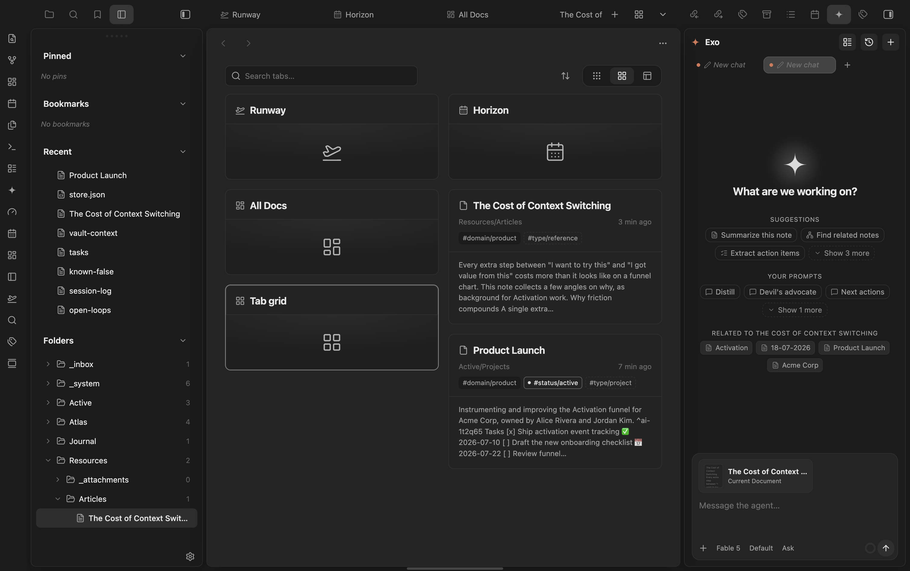

# TabX

See your open tabs as a **vertical rail** in the sidebar and as a **Masonry-style
grid** — with an optional hover-to-reveal sidebar and a horizontally-scrolling
native tab bar.

Part of the marioverse Obsidian plugin suite (sibling of Masonry, Horizon,
Sonar…).

  

<em>Every open tab as a Masonry-style card, with live content previews.</em>

## Features

- **Rail** — a left-sidebar panel listing every open tab as a vertical row
  (icon + full title + close-on-hover). Click to activate, middle-click or the
  ✕ to close. The active tab is highlighted live.
- **Tab grid** — a Masonry-style card view of your open tabs (icon, title,
  folder + date, tag chips, cover image + lazy-loaded excerpt). A visual tab
  switcher: click a card to jump to that tab. **Search** (title / folder / tags)
  and **sort** (tab order, recently modified, title) from the header, plus
  three densities (compact / editorial / visual). Open it from the rail header,
  the button in the main tab bar, or the command.
- **Auto-hide** — hide the horizontal note tab bar and reveal it on hover at
  the top of the pane, reclaiming vertical space. Off by default.
- **Scrolling tab bar** — let the native top tab bar scroll horizontally
  instead of shrinking each tab to an unreadable sliver. On by default.

## Install (manual / dev)

1. Build: `pnpm install && pnpm build`.
2. Copy `main.js`, `manifest.json`, `styles.css` into
   `<vault>/.obsidian/plugins/tabx/` (or point `.obsidian-plugin-dir` at it and
   run `pnpm dev`).
3. Enable **TabX** in Settings → Community plugins.
4. Run the command **TabX: Open tab rail** (or click the ribbon icon).

## Settings

| Setting | Default | What it does |
|---|---|---|
| Auto-hide tab bar | off | Hide the horizontal note tab bar; reveal on hover at the top. |
| Scrolling horizontal tab bar | on | Native tab bar scrolls instead of shrinking tabs. |
| Minimum tab width | 120 px | Width each tab keeps before the bar scrolls. |
| Tab grid button in tab bar | on | Inject an "open tab grid" button next to the native "+". |
| Default card density | editorial | Initial grid layout (compact / editorial / visual). |
| Default sort | tab order | Initial grid sort (tab order / recently modified / title). |
| Show card previews | on | Load a short excerpt on each grid card. |
| Preview length | 240 | Max characters per card excerpt. |

## Commands

- **Open tab rail** (also a ribbon icon)
- **Open tab grid**
- **Toggle tab bar auto-hide**

## Mobile

**Verified** — `isDesktopOnly: false` in `manifest.json`; `styles.css` ships a `pointer: coarse` media query with 44px hit areas on small controls.

## Performance

Scale is bounded by the number of open tabs (typically a few dozen), so TabX
renders the full list rather than virtualizing. It debounces layout changes,
updates the active-tab highlight in O(1), lazy-loads grid previews via an
`IntersectionObserver`, caches excerpts (LRU over `cachedRead`), and never
forces deferred tab views to load just to draw a row.

## Try it

See it running in the [Obsidianverse sample vault](https://github.com/mariomile/obsidianverse-sample-vault), a small, fictional vault with the whole plugin suite pre-configured.

## License

MIT © Mario Miletta
